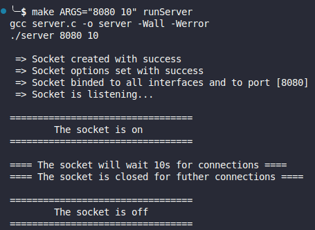
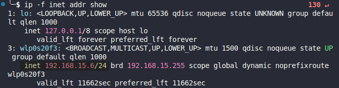
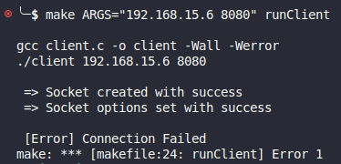
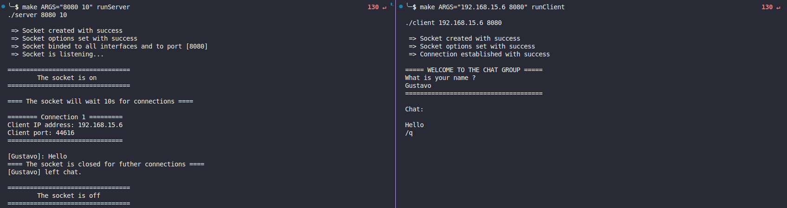
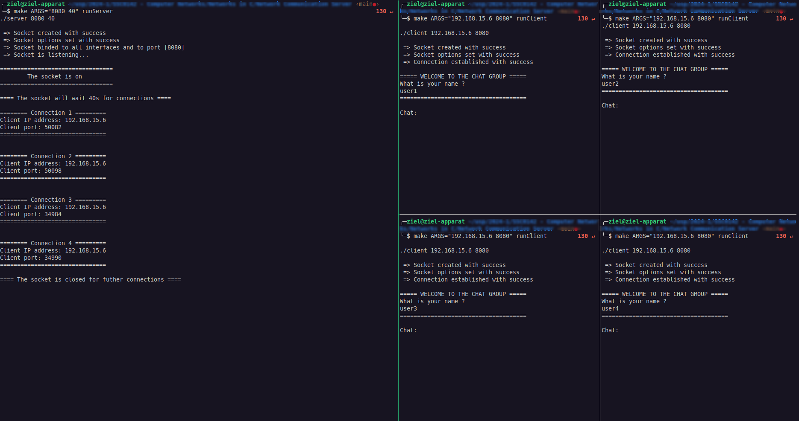
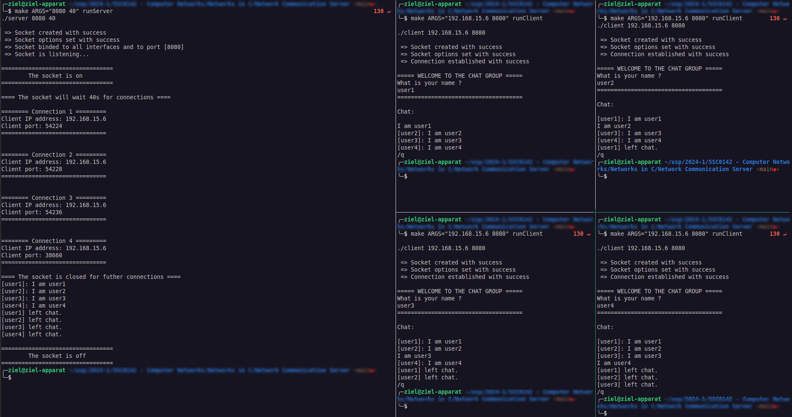

# Aplicação de Comunicação via Sockets

## Desenvolvedores:

- Gustavo Gabriel Ribeiro
- [Outros Membros do Grupo, se houver]

## Descrição

.gif)

Este projeto foi desenvolvido como parte do trabalho da disciplina de Redes de Computadores.

A aplicação criada permite a **comunicação entre dois ou mais processos distintos**, que podem estar em **execução na mesma máquina ou em máquinas diferentes** conectadas em rede.

Para a comunicação, **utilizamos sockets**, um dos mecanismos mais comuns para troca de informações em rede.

A conexão entre servidor e clientes foi desenvolvida de forma a utilizar do **protocolo da camada de transporte TCP**, na qual há uma **conexão full-duplex duradoura** entre os processos envolvidos.

Empregamos **threads** para o gerenciamento e troca de mensagens concomitantes entre os clientes.

## Estrutura do Projeto

O projeto é composto por dois arquivos principais:

1. **server.c**: Implementa o lado do servidor da aplicação.
2. **client.c**: Implementa o lado do cliente da aplicação.

## Funcionalidades

- **Servidor**: Aceita conexões de múltiplos clientes e permite a troca de mensagens entre eles.
- **Cliente**: Conecta-se ao servidor e permite o envio e recebimento de mensagens.

## Requisitos

Para compilar e executar este projeto, você precisará dos seguintes requisitos:

- GCC (GNU Compiler Collection)
- Sistema operacional Unix-like (Linux ou macOS)

## Como Compilar

Para compilar o projeto, siga os seguintes passos:

1. Clone esse repositório:

```bash
git clone git@github.com:GustavoZiel/network-communication-server.git
```

2. Navegue até os arquivos fonte do projeto: 

```bash
cd src
```

> Execute os comandos makefile correspondentes:

3. Executando cliente e servidor em uma mesma máquina:
   - Em um terminal, inicie o servidor:

   ```bash
   make ARGS="<PORT> <TIMEOUT>" runServer
   ```
   
   - Em outro terminal, inicie o cliente:

   ```bash
   make ARGS="<IP_ADDRESS> <PORT>" runClient
   ```

   > O servidor deve ser iniciado primeiro para que a conexão dos clientes seja bem sucedida

   > Pode haver vários terminais clientes se conectando ao mesmo terminal servidor

1. Executando cliente e servidor em máquinas distintas:
   - Na máquina que servirá de servidor, execute:

   ```bash
   make ARGS="<PORT> <TIMEOUT>" runServer
   ```

   - Nas demais máquinas clientes, execute:

   ```bash
   make ARGS="<IP_ADDRESS> <PORT>" runClient
   ```

## Como Configurar

> Essa etapa é essencial para o correto funcionamento da aplicação

### Server

```c
make ARGS="<PORT> <TIMEOUT>" runServer
```

#### PORT

- É necessário especificar a PORT em que o servidor estará ouvindo

#### TIMEOUT

- É necessário especificar quanto tempo o servidor permanecerá aberto aguardando por conexões
- `TIMEOUT` é medido em segundos
- Caso `TIMEOUT <= 0`, o servidor ficará aguardando por conexões indefinidamente (até que todos os clientes conectados saiam)

#### Exemplo

```c
make ARGS="8080 10" runServer
```

Nesse exemplo, o servidor aguardará por conexões na porta 8080 durante 10 segundos.



### Cliente

```C
make ARGS="<IP_ADDRESS> <PORT>" runClient
```

make ARGS="192.168.15.6 8080" runClient

#### IP e PORT

- É necessário especificar o IP e PORT em que os clientes tentarão se conectar
- Caso esteja executando o cliente e o servidor na mesma máquina, utilize O comando `ip -f inet addr show` para o obter o ip inet da máquina (**atenção, localhost 127.0.0.1 não é válido)**



#### Exemplo



Ocorre um erro nesse caso, pois o servidor não está a escuta, dessa forma, o cliente não consegue se conectar.

## Como Utilizar

Aqui está o trecho corrigido:

Após seguir os passos das seções de [compilação](#como-compilar) e [configuração](#como-configurar), você terá, em um terminal, o servidor aguardando por conexões, e em outros, clientes se conectando.

### Exemplos de Uso

#### 1 Cliente e 1 Servidor



- Compreendendo o exemplo:
  1. O servidor é iniciado e fica escutando na porta 8080 por 10 segundos.
  2. O cliente tenta se conectar ao IP 192.168.15.6 na porta 80.
  3. O servidor aceita a nova conexão e imprime informações sobre o cliente: IP do cliente e porta pela qual o cliente realizou a conexão.
  4. O cliente é introduzido ao chat e deve informar seu nome.
  5. Após o servidor receber o nome do cliente, o chat se inicia de fato.
  6. As mensagens enviadas pelo cliente são visíveis para o servidor e marcadas pelo nome do cliente que as enviou.
  7. O tempo de espera por novas conexões do servidor se encerra.
  8. O cliente, ao digitar '/q', sai do chat.
  9. O servidor recebe a notificação de que o cliente se desconectou.
  10. Como o servidor não está mais esperando por clientes e todos os clientes se desconectaram, ele se encerra.

#### N Clientes e 1 Servidor




## Considerações Finais

Este projeto foi desenvolvido com o intuito de entender e implementar a comunicação via sockets em C. Sinta-se à vontade para modificar e expandir a funcionalidade do projeto conforme necessário.